# Database schema

This is a logical schema map of the current PostgreSQL database. It reflects
the latest migration names (for example, singular `transform_*` tables), rather
than the historical names that appear in older migrations.

A draw.io diagram derived from this map — rounded-rectangle tables grouped by
surface (Platform, Billing, Editor, Creator: sources, Creator: transforms)
with every relationship below drawn as an edge — lives at
[`database-schema.drawio`](database-schema.drawio).

```mermaid
erDiagram
    users {
        int user_id PK
        text email UK
        text name
        text password_hash
        bool is_admin
        bool is_active
        bool is_verified
        timestamptz created_at
    }

    projects {
        int project_id PK
        text name
        int created_by FK
        timestamptz created_at
    }

    project_members {
        int project_id PK, FK
        int user_id PK, FK
        text role
        timestamptz joined_at
    }

    tracks {
        int track_id PK
        int project_id FK
        text name
        text extension
        real length_seconds
        timestamptz created_at
    }

    track_storage {
        int track_id PK, FK
        text storage_type
        bytea data
        text uri
        timestamptz created_at
    }

    region_sets {
        int region_set_id PK
        int track_id FK
        text name
        real track_length_seconds
        timestamptz created_at
    }

    regions {
        int region_id PK
        int region_set_id FK
        text name
        real start_time_seconds
        real end_time_seconds
        timestamptz created_at
    }

    graphs {
        int graph_id PK
        int region_id FK, UK
        text name
        jsonb graph_state
        int version
        timestamptz created_at
        timestamptz updated_at
    }

    sources {
        int source_id PK
        int project_id FK
        text name
        text extension
        real length_seconds
        timestamptz created_at
    }

    source_storage {
        int source_id PK, FK
        text storage_type
        bytea data
        text uri
        timestamptz created_at
    }

    transform {
        bigint transform_id PK
        text name UK
        text description
        text icon
        text kind
        timestamptz created_at
    }

    transform_draft {
        bigint transform_id PK, FK
        text source_code
        bytea wasm_bytecode
        text wasm_source_code
        text name
        text description
        jsonb graph_definition
        jsonb ports
        jsonb params
        bool is_validated
        timestamptz updated_at
    }

    transform_ticket {
        bigint ticket_id PK
        bigint transform_id FK
        bigint issued_by FK
        text source_code
        text status
        text error_message
        timestamptz created_at
    }

    transform_resource {
        bigint resource_id PK
        bigint ticket_id FK, UK
        bytea wasm_bytecode
        text name
        text description
        jsonb ports
        jsonb params
        timestamptz created_at
    }

    transform_binary {
        bigint transform_id PK, FK
        bytea wasm_bytecode
        text source
        timestamptz created_at
        timestamptz updated_at
    }

    transform_composite {
        bigint transform_id PK, FK
        jsonb graph_definition
        timestamptz created_at
        timestamptz updated_at
    }

    transform_port {
        bigint port_id PK
        bigint transform_id FK
        text name
        text direction
        int port_order
        text description
        text kind
        text cardinality
    }

    transform_param {
        bigint param_id PK
        bigint transform_id FK
        text name
        int param_order
        real default_value
        real min_value
        real max_value
        text description
        timestamptz created_at
    }

    tier_configs {
        int id PK
        text tier UK
        int max_projects
        int max_tracks_per_project
        bigint max_storage_bytes
        timestamptz updated_at
    }

    products {
        int id PK
        text name
        text description
        text tier
        bigint price_cents
        text currency
        bool is_active
        timestamptz created_at
    }

    subscriptions {
        int id PK
        int user_id FK
        text tier
        bool is_active
        timestamptz started_at
        timestamptz expires_at
    }

    purchased_products {
        int id PK
        int user_id FK
        int product_id FK
        timestamptz purchased_at
    }

    invoices {
        int id PK
        int user_id FK
        text stripe_invoice_id
        bigint amount
        text currency
        text status
        text hosted_url
        timestamptz created_at
    }

    usage {
        int id PK
        int user_id FK, UK
        bigint project_count
        bigint total_track_count
        bigint total_storage_bytes
        timestamptz updated_at
    }

    users ||--o{ projects : creates
    users ||--o{ project_members : belongs_to
    projects ||--o{ project_members : has_members
    projects ||--o{ tracks : contains
    tracks ||--|| track_storage : stores_audio_in
    tracks ||--o{ region_sets : has
    region_sets ||--o{ regions : has
    regions ||--o| graphs : owns

    projects ||--o{ sources : contains
    sources ||--|| source_storage : stores_audio_in

    transform ||--|| transform_draft : has_working_copy
    transform ||--o{ transform_ticket : compile_attempts
    users ||--o{ transform_ticket : issues
    transform_ticket ||--o| transform_resource : produces
    transform ||--o| transform_binary : published_primitive
    transform ||--o| transform_composite : published_composite
    transform ||--o{ transform_port : exposes
    transform ||--o{ transform_param : configures

    users ||--o{ subscriptions : has
    users ||--o{ purchased_products : buys
    products ||--o{ purchased_products : purchased_as
    users ||--o{ invoices : billed
    users ||--o| usage : aggregates
```

## Surface mapping

| Product surface | Primary tables |
| --- | --- |
| Editor | `projects`, `project_members`, `tracks`, `track_storage`, `region_sets`, `regions`, `graphs` |
| Creator: source audition | `sources`, `source_storage` |
| Creator: compile / save / publish | `transform_ticket`, `transform_resource`, `transform_draft`, `transform`, `transform_binary`, `transform_composite`, `transform_port`, `transform_param` |
| Shared platform | `users`, billing tables, project membership |

## Important implementation notes

- `graphs.graph_state` is a JSONB Editor graph document. It stores nodes and
  edges rather than using relational graph-node and graph-edge tables.
- The Creator transform lifecycle deliberately stores snapshots in three
  locations: compile resource, saved draft, and published artifact.
- `transform_binary` represents published primitive WASM; `transform_composite`
  represents a published composite graph. They are alternative published forms.
- `track_storage` and `source_storage` are one-to-one storage tables that allow
  inline bytes or a URI; callers currently use inline bytes.
